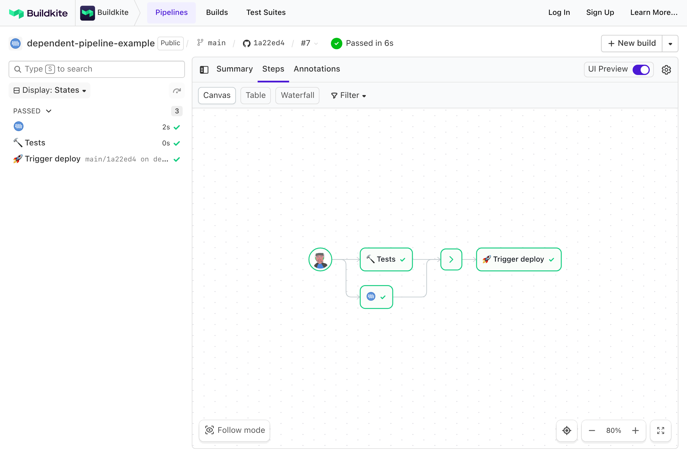

# Buildkite Dependent Pipeline Example

This repository is an example [Buildkite](https://buildkite.com/) pipeline that shows how to trigger another pipeline using [Triggers Steps](https://buildkite.com/docs/pipelines/trigger-step).

👉 **See this example in action:** [buildkite/dependent-pipeline-example](https://buildkite.com/buildkite/dependent-pipeline-example/builds/latest)

## Getting Started

### 1. Create the test pipeline

The test pipeline uses [.buildkite/pipeline.yml](.buildkite/pipeline.yml) to run the tests and trigger deployment builds on the main branch:

### 2. Create the deployment pipeline

The deployment pipeline uses [pipeline.deploy.yml](.buildkite/pipeline.deploy.yml) to perform deployments, and can be run independently of the test pipeline:

### 3. Run a build on the test pipeline

Once you’ve created the two pipelines, trigger a build on your test pipeline to see it all in action!

## License

See [LICENSE](LICENSE) (MIT)
