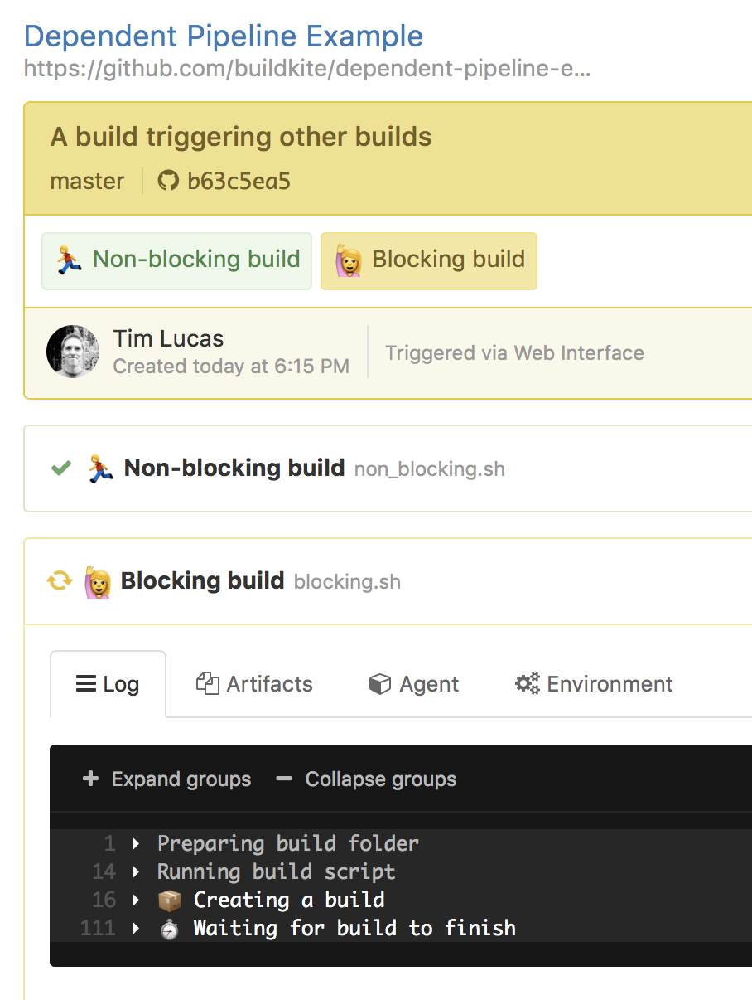

# Buildkite Dependent Pipeline Example

This repository is an example [Buildkite](https://buildkite.com/) pipeline that shows how to trigger another build pipeline from within a pipeline using the [Create Build API](https://buildkite.com/docs/api/builds#create-a-build).

There are two example steps:

* [blocking.sh](blocking.sh) - this creates a build and waits for it to finish. The step will pass only if the other build passes.
* [non_blocking.sh](non_blocking.sh) - this creates anoter build and returns a success

## Screenshot

## License

See [Licence.md](Licence.md) (MIT)
